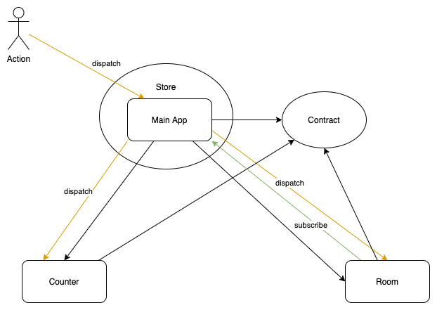

# Redux-modularization

Idea: 
- https://github.com/ReSwift/ReSwift/issues/377
- https://github.com/Rakuten-MTSD-PAIS/mavenir-android-client-snapshot/pull/4012/files

1 store.

Each feature module has:
- Reducer
- Action
- Store reference

All state definations and protocols are defined in Contract module (can be seperated to CounterContract, RoomContract...).

